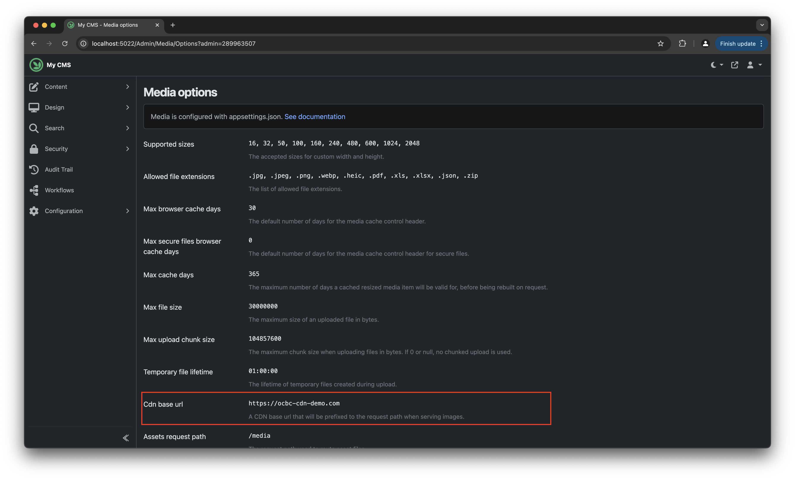

# CDN for Media

The Media module in Orchard Core manages media files stored in the `Media` folder. By default, media files are served directly from our CMS. However, when a **CDN Base URL** is configured, Orchard Core replaces the default URL with the CDN URL in the generated media links.

For example:

* Default URL: `http://localhost:5022/media/example.jpg`
* CDN URL: `https://ocbc-cdn-demo.com/media/example.jpg`

We can configure the `CdnBaseUrl` dynamically in our `Program.cs` of our core CMS project as demonstrated below.

```csharp
services.PostConfigure<MediaOptions>(o => {
    // ...
    
    o.CdnBaseUrl = "https://ocbc-cdn-demo.com";
});
```

To verify that the setting has been applied, we can visit the Administration UI to get the Media CDN URL, as shown in the following screenshot.

<figure><figcaption><p>The Media CDN base URL will be shown here if it is correctly configured.</p></figcaption></figure>

Orchard Core provides the `IMediaFileStore` service to manage media files and generate URLs programmatically. For example:

```csharp
// ...
using OrchardCore.Media;

namespace OCBC.HeadlessCMS.Controllers;

[ApiController]
[Route("api/v1/product")]
public class ProductController(
    // ...
    IMediaFileStore mediaFileStore) : Controller
{
    [HttpGet("get-media-cdn")]
    public async Task<IActionResult> GetMediaCdn()
    {
        return Ok(mediaFileStore.MapPathToPublicUrl("/15-autumn-in-japan-body.jpg"));
    }
}
```

The demo endpoint above will return the value "`https://ocbc-cdn-demo.com/media/15-autumn-in-japan-body.jpg`".
